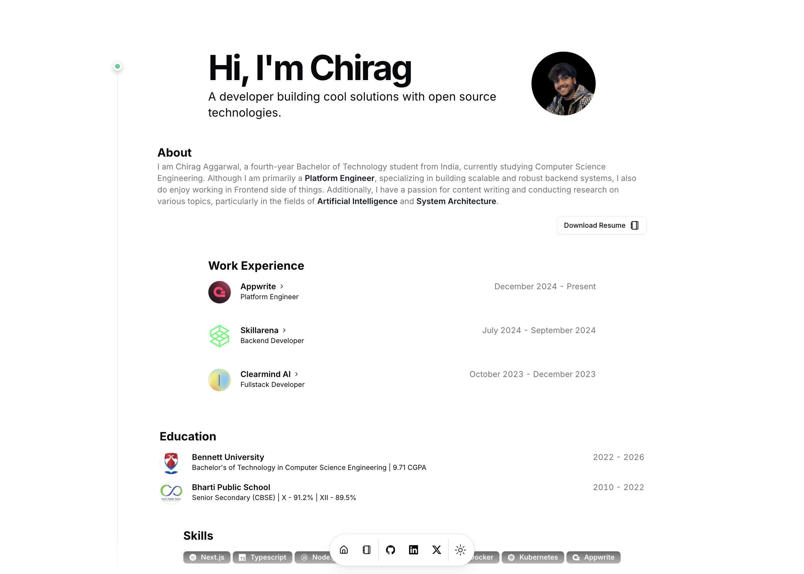

This is a profile website built with Next.js, Tailwind CSS, and TypeScript. It is a simple and clean website that showcases my skills and projects.

Check out the live website [here](https://www.chiragaggarwal.tech/).

## License

This project is licensed under the MIT License. See the [LICENSE](LICENSE) file for details.

## Acknowledgements

Thanks to [Magicui](https://magicui.design/docs/templates/portfolio) for the template.
