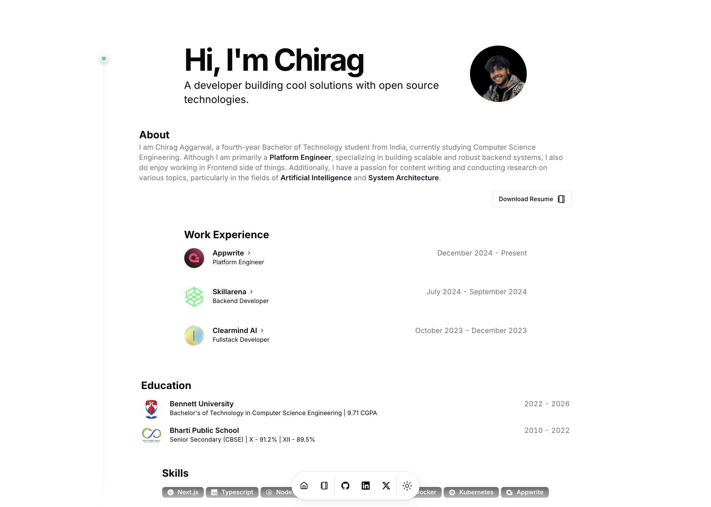

[](https://tanstack.com/start)
[](https://appwrite.io/)
[](https://vite.dev/)
[](https://tailwindcss.com/)
[](https://www.typescriptlang.org/)

This is a profile website built with TanStack Start, Tailwind CSS, and TypeScript. It is a simple and clean website that showcases my skills and projects.

Check out the live website [here](https://www.chiragaggarwal.tech/).

The site application lives in [sites/profile-website](/Users/chiragaggarwal/Desktop/personal/profile-website/sites/profile-website). The repo root keeps shared wrapper files such as [appwrite.config.json](/Users/chiragaggarwal/Desktop/personal/profile-website/appwrite.config.json) and convenience scripts.

## Development

Run the site from the repo root:

```bash
bun run install:site
bun run dev
bun run format
```

Or work directly inside `sites/profile-website`:

```bash
cd sites/profile-website
bun install
bun run dev
```

## License

This project is licensed under the MIT License. See the [LICENSE](LICENSE) file for details.

## Acknowledgements

Thanks to [Magicui](https://magicui.design/docs/templates/portfolio) for the template.
